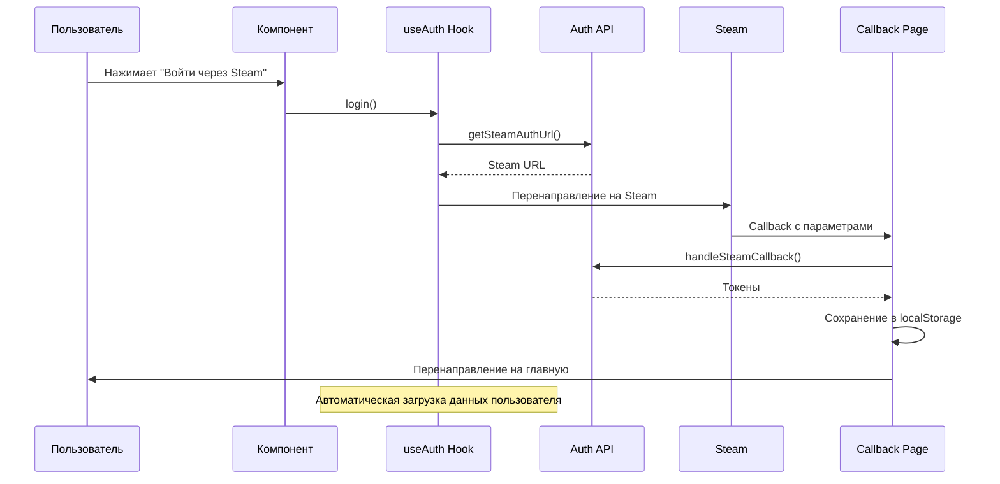

# Дизайн интеграции Steam авторизации

## Обзор

Система интеграции Steam авторизации объединяет существующие API методы с пользовательским интерфейсом через доработанный хук `useAuth`. Основная задача - заменить моковые данные на реальные API вызовы и обеспечить корректную обработку состояний авторизации.

## Архитектура

### Компоненты системы

```
┌─────────────────┐    ┌──────────────────┐    ┌─────────────────┐
│   UI Components │    │    useAuth Hook  │    │   Auth API      │
│                 │    │                  │    │                 │
│ - SteamLoginBtn │◄──►│ - login()        │◄──►│ - getSteamUrl() │
│ - Header        │    │ - logout()       │    │ - handleCallback│
│ - AuthPrompt    │    │ - user state     │    │ - getMe()       │
│                 │    │ - loading state  │    │ - refreshToken()│
└─────────────────┘    └──────────────────┘    └─────────────────┘
                                │
                                ▼
                       ┌──────────────────┐
                       │   localStorage   │
                       │                  │
                       │ - access_token   │
                       │ - refresh_token  │
                       └──────────────────┘
```

### Поток авторизации



## Компоненты и интерфейсы

### Обновленный useAuth Hook

```typescript
interface IAuthState {
  isAuthenticated: boolean
  isLoading: boolean
  user: IUser | null
  error: string | null
}

interface IAuthActions {
  login: () => Promise<void>
  logout: () => Promise<void>
  refreshUserData: () => Promise<void>
  clearError: () => void
}

export const useAuth = (): IAuthState & IAuthActions
```

### Состояния хука

1. **Начальное состояние**: `isLoading: true`, проверка токенов
2. **Авторизован**: `isAuthenticated: true`, `user` заполнен
3. **Не авторизован**: `isAuthenticated: false`, `user: null`
4. **Ошибка**: `error` содержит сообщение об ошибке

### Интеграция с существующими API

#### Auth API методы (уже реализованы)

- `getSteamAuthUrl()` - получение URL для авторизации
- `handleSteamCallback()` - обработка callback от Steam
- `getMe()` - получение базовой информации пользователя
- `refreshToken()` - обновление токенов
- `logout()` - выход из системы

#### Users API методы (нужно использовать)

- `getMe()` - получение полной информации пользователя (баланс, аватар и т.д.)

## Модели данных

### Расширенный интерфейс пользователя

```typescript
interface IAuthUser extends IUser {
  // Базовые данные из auth/me
  id: string
  steamId: string
  role: string
  status: string

  // Дополнительные данные из users/me
  username: string
  email: string
  avatar: string
  balance: number
  currency: string
  steamTradeUrl: string
  language: string
}
```

### Состояние ошибок

```typescript
type AuthError =
  | 'STEAM_URL_ERROR'
  | 'CALLBACK_ERROR'
  | 'USER_DATA_ERROR'
  | 'TOKEN_REFRESH_ERROR'
  | 'LOGOUT_ERROR'
  | 'NETWORK_ERROR'
```

## Обработка ошибок

### Стратегии обработки

1. **Ошибки авторизации**: Показ уведомления, сброс состояния
2. **Ошибки сети**: Повторные попытки с экспоненциальной задержкой
3. **Ошибки токенов**: Автоматическое обновление через интерцептор
4. **Критические ошибки**: Принудительный выход и очистка данных

### Обработка в компонентах

```typescript
// В SteamLoginButton
const handleLogin = async () => {
  try {
    setIsLoading(true)
    await login()
  } catch (error) {
    // Показать toast с ошибкой
    showError('Ошибка авторизации. Попробуйте еще раз.')
  } finally {
    setIsLoading(false)
  }
}
```

## Стратегия тестирования

Поскольку автоматические тесты не пишем, тестирование будет проводиться вручную:

### Сценарии тестирования

1. **Успешная авторизация**

   - Нажатие кнопки → перенаправление на Steam → возврат → отображение данных

2. **Восстановление сессии**

   - Перезагрузка страницы с валидными токенами → автоматическая авторизация

3. **Обновление токенов**

   - Истечение access_token → автоматическое обновление → продолжение работы

4. **Выход из системы**

   - Нажатие "Выйти" → очистка данных → сброс состояния

5. **Обработка ошибок**
   - Различные сценарии ошибок → корректные сообщения → восстановление

## Производительность

### Оптимизации

1. **Кэширование данных пользователя**: Избегание повторных запросов
2. **Ленивая загрузка**: Загрузка данных только при необходимости
3. **Дебаунсинг**: Предотвращение множественных запросов
4. **Мемоизация**: Кэширование вычисляемых значений в хуке

### Управление состоянием

```typescript
// Использование useCallback для предотвращения лишних рендеров
const login = useCallback(async () => {
  // Логика авторизации
}, [])

// Мемоизация пользователя
const memoizedUser = useMemo(() => user, [user])
```

## Безопасность

### Меры безопасности

1. **Валидация токенов**: Проверка формата и срока действия
2. **Безопасное хранение**: Использование localStorage с проверками
3. **Очистка данных**: Полная очистка при выходе или ошибках
4. **HTTPS**: Все запросы только через защищенное соединение

### Обработка токенов

```typescript
// Безопасное получение токена
const getTokenSafely = (): string | null => {
  try {
    const token = localStorage.getItem('access_token')
    // Дополнительная валидация токена
    return isValidToken(token) ? token : null
  } catch {
    return null
  }
}
```

## Интеграция с существующими компонентами

### Изменения в компонентах

1. **SteamLoginButton**: Использование реального метода `login()`
2. **Header**: Отображение состояния загрузки при авторизации
3. **AuthPrompt**: Обработка ошибок авторизации
4. **Callback Page**: Уже реализована, минимальные изменения

### Обратная совместимость

Все изменения должны быть обратно совместимы с существующим интерфейсом хука `useAuth`. Компоненты продолжат работать без изменений в API.
